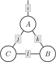
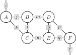

# WiringDiagrams.jl

WiringDiagrams.jl is a high-performance Julia library for working
with wiring diagrams and their algebras.

## Wiring Diagrams

A wiring diagram is a combinatorial representation of a
class of functions. For example, consider the diagram $d$
shown below.

<p align="center">
    
</p>

This diagram could represent the projected intersection
of relations

```math
    D := \{i : (i, j, k) ∈ A \text{ and } (k, l) ∈ B \text{ and } (l, j) ∈ C\}
```

... or the summed product of arrays

```math
    D_i := \sum_j \sum_k \sum_l A_{ijk} \times B_{kl} \times C_{lj}
```

... or the infimized sum of convex functions

```math
    D(i) := \inf_j \inf_k \inf_l A(i, j, k) + B(k, l) + C(l, j)
```

... or the marginalized product of conditional probability
distributions

```math
    D(i) := \int A(i \mid j, k) \times B(k \mid l) \times C(j, l) \, dj \, dk \, dl
```

... or the SQL query

```sql
SELECT A.i
FROM A
    INNER JOIN B
        ON A.k = B.k
    INNER JOIN C
        ON A.j = C.j AND B.l = C.l
```

and so on and so forth. Each of these different interetations
is specified by a *wiring diagram algebra*. Algebras are
higher-order functions that transform wiring diagrams into
functions. For any algebra $a$, we can write

```math
    D := a(d)(A, B, C).
```

### Example

```julia-repl
julia> using OMEinsum, WiringDiagrams

julia> A = rand(2, 3, 4); B = rand(4, 5); C = rand(5, 3);

julia> d = WiringDiagram(
           [['i', 'j', 'k'], ['k', 'l'], ['l', 'j']],
           ['i'],
           Dict('i' => 2, 'j' => 3, 'k' => 4, 'l' => 5),
       )
3-box FWiringDiagram{Int64, Int64}:
 [2]
 └─ [2, 3, 4]
 └─ [4, 5]
 └─ [5, 3]

julia> a = ArrayAlgebra{Array{Float64}}()
ArrayAlgebra{Array{Float64}}()

julia> D = a(d)(A, B, C)
2-element Vector{Float64}:
4.765630333539594
6.775309980242036
```

## Dendrograms

Applying algebras to large wiring diagrams can be expensive.
Consider the diagram $d$ shown below.

<p align="center">
    
</p>

If each index has ten dimensions, then this tensor contraction
requres $10^{10}$ floating point operations. We can address this
problem by *factorizing* this wiring diagram into a tree of smaller
wiring diagrams. The resulting object is called a dendrogram.

### Example

```julia-repl
julia> OMEinsum, WiringDiagrams

julia> A = 0.1rand(10, 10, 10); B = 0.1rand(10, 10, 10); C = 0.1rand(10, 10, 10);

julia> D = 0.1rand(10, 10, 10); E = 0.1rand(10, 10, 10); F = 0.1rand(10, 10, 10);

julia> d = WiringDiagram(
           [['i', 'j', 'k'], ['j', 'l', 'm'], ['k', 'l', 'n'],
            ['m', 'o', 'p'], ['n', 'o', 'q'], ['p', 'q', 'r']],
           ['i', 'r'],
           Dict('i' => 10, 'j' => 10, 'k' => 10, 'l' => 10, 'm' => 10,
                'n' => 10, 'o' => 10, 'p' => 10, 'q' => 10, 'r' => 10),
       )
6-box FWiringDiagram{Int64, Int64}:
 [10, 10]
 └─ [10, 10, 10]
 └─ [10, 10, 10]
 └─ [10, 10, 10]
 └─ [10, 10, 10]
 └─ [10, 10, 10]
 └─ [10, 10, 10]

julia> a = ArrayAlgebra{Array{Float64}}()
ArrayAlgebra{Array{Float64}}()

julia> @time G = a(d)(A, B, C, D, E, F)
 15.653926 seconds (74 allocations: 4.812 KiB)
10×10 Matrix{Float64}:
 1.58487  1.5005   1.48393  1.38662  1.50858  1.66205  1.52331  1.50189  1.6014   1.50579
 1.55629  1.47338  1.45697  1.36155  1.48148  1.63212  1.49593  1.47491  1.5725   1.47883
 1.56883  1.48523  1.4689   1.37246  1.49342  1.64534  1.50804  1.48676  1.58527  1.49074
 1.52926  1.44762  1.43196  1.33777  1.45569  1.6039   1.47004  1.44926  1.54522  1.45292
 1.45117  1.37381  1.35857  1.26958  1.38138  1.52187  1.39495  1.3752   1.46628  1.37903
 1.57142  1.48773  1.47146  1.37473  1.49582  1.64807  1.51056  1.48922  1.58792  1.49303
 1.75305  1.65969  1.64141  1.53364  1.66866  1.83847  1.68514  1.66122  1.77139  1.6657
 1.50314  1.42307  1.40727  1.31518  1.43091  1.57645  1.44483  1.42452  1.51882  1.42832
 1.43558  1.35907  1.34413  1.25591  1.3665   1.50555  1.37997  1.36044  1.4505   1.36413
 1.51229  1.43172  1.41616  1.32295  1.43951  1.58608  1.4538   1.43311  1.52816  1.4369

julia> f = Dendrogram(log2, d)
6-box FDendrogram{Int64, Int64}:
 [10, 10]
 └─ [10, 10, 10]
 └─ [10, 10, 10]
 └─ [10, 10, 10]
 └─ [10, 10, 10]
 └─ [10, 10, 10]
 └─ [10, 10, 10]

julia> @time G = a(f)(A, B, C, D, E, F)
  0.000269 seconds (979 allocations: 683.359 KiB)
10×10 Matrix{Float64}:
 1.58487  1.5005   1.48393  1.38662  1.50858  1.66205  1.52331  1.50189  1.6014   1.50579
 1.55629  1.47338  1.45697  1.36155  1.48148  1.63212  1.49593  1.47491  1.5725   1.47883
 1.56883  1.48523  1.4689   1.37246  1.49342  1.64534  1.50804  1.48676  1.58527  1.49074
 1.52926  1.44762  1.43196  1.33777  1.45569  1.6039   1.47004  1.44926  1.54522  1.45292
 1.45117  1.37381  1.35857  1.26958  1.38138  1.52187  1.39495  1.3752   1.46628  1.37903
 1.57142  1.48773  1.47146  1.37473  1.49582  1.64807  1.51056  1.48922  1.58792  1.49303
 1.75305  1.65969  1.64141  1.53364  1.66866  1.83847  1.68514  1.66122  1.77139  1.6657
 1.50314  1.42307  1.40727  1.31518  1.43091  1.57645  1.44483  1.42452  1.51882  1.42832
 1.43558  1.35907  1.34413  1.25591  1.3665   1.50555  1.37997  1.36044  1.4505   1.36413
 1.51229  1.43172  1.41616  1.32295  1.43951  1.58608  1.4538   1.43311  1.52816  1.4369
```

## Algebras

In order to define a wiring diagram algebra, define a subtype of `AbstractAlgebra` 

```julia
struct MyAlgebra{A} <: AbstractAlgebra{A}
```

and define a method for the function `apply`.

```julia
apply(algebra::MyAlgebra, diagram::AbstractDiagram, arguments)
```

The object computed by `apply` should be convertible to the type `A`.
