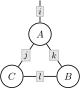
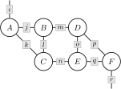

# WiringDiagrams.jl

WiringDiagrams.jl is a high-performance Julia library for working
with wiring diagrams and their algebras.

## Wiring Diagrams

A wiring diagram is a combinatorial representation of a
class of functions. For example, consider the diagram $d$
shown below.



This diagram could represent the projected intersection
of relations

```math
    D := \{i : (i, j, k) ∈ A \text{ and } (k, l) ∈ B \text{ and } (l, j) ∈ C\}
```

... or the summed product of arrays

```math
    D_i := \sum_j \sum_k \sum_l A_{ijk} \times B_{kl} \times C_{lj}
```

... or the infimized sum of convex functions

```math
    D(i) := \inf_j \inf_k \inf_l A(i, j, k) + B(k, l) + C(l, j)
```

and so on and so forth. Each of these different interetations
is specified by a *wiring diagram algebra*. Algebras are
higher-order functions that transform wiring diagrams into
functions. For any algebra $a$, we can write

```math
    D := a(d)(A, B, C).
```

### Example

```julia-repl
julia> using OMEinsum, WiringDiagrams

julia> A = rand(2, 3, 4); B = rand(4, 5); C = rand(5, 3);

julia> d = WiringDiagram(
           [['i', 'j', 'k'], ['k', 'l'], ['l', 'j']],
           ['i'],
           Dict('i' => 2, 'j' => 3, 'k' => 4, 'l' => 5),
       )
3-box FWiringDiagram{Int64, Int64}:
 [2]
 └─ [2, 3, 4]
 └─ [4, 5]
 └─ [5, 3]

julia> a = ArrayAlgebra{Array{Float64}}()
ArrayAlgebra{Array{Float64}}()

julia> D = a(d)(A, B, C)
2-element Vector{Float64}:
4.765630333539594
6.775309980242036
```

## Dendrograms

Applying algebras to large wiring diagrams can be expensive.
Consider the diagram $d$ shown below.



If each index has ten dimensions, then this tensor contraction
requres $10^{10}$ floating point operations. We can address this
problem by *factorizing* this wiring diagram into a tree of smaller
wiring diagrams. The resulting object is called a dendrogram.

### Example

```julia-repl
julia> OMEinsum, WiringDiagrams

julia> A = 0.1rand(10, 10, 10); B = 0.1rand(10, 10, 10); C = 0.1rand(10, 10, 10);

julia> D = 0.1rand(10, 10, 10); E = 0.1rand(10, 10, 10); F = 0.1rand(10, 10, 10);

julia> d = WiringDiagram(
           [['i', 'j', 'k'], ['j', 'l', 'm'], ['k', 'l', 'n'],
            ['m', 'o', 'p'], ['n', 'o', 'q'], ['p', 'q', 'r']],
           ['i', 'r'],
           Dict('i' => 10, 'j' => 10, 'k' => 10, 'l' => 10, 'm' => 10,
                'n' => 10, 'o' => 10, 'p' => 10, 'q' => 10, 'r' => 10),
       )
6-box FWiringDiagram{Int64, Int64}:
 [10, 10]
 └─ [10, 10, 10]
 └─ [10, 10, 10]
 └─ [10, 10, 10]
 └─ [10, 10, 10]
 └─ [10, 10, 10]
 └─ [10, 10, 10]

julia> a = ArrayAlgebra{Array{Float64}}()
ArrayAlgebra{Array{Float64}}()

julia> @time G = a(d)(A, B, C, D, E, F);
 15.653926 seconds (74 allocations: 4.812 KiB)

julia> f = Dendrogram(log2, d)
6-box FDendrogram{Int64, Int64}:
 [10, 10]
 └─ [10, 10, 10]
 └─ [10, 10, 10]
 └─ [10, 10, 10]
 └─ [10, 10, 10]
 └─ [10, 10, 10]
 └─ [10, 10, 10]

julia> @time G = a(f)(A, B, C, D, E, F);
  0.000269 seconds (979 allocations: 683.359 KiB)
```

## Algebras

In order to define a wiring diagram algebra, create a concrete subtype of
`AbstractAlgebra`

```julia
struct MyAlgebra{A} <: AbstractAlgebra{A} end
```

and define a method for the function `apply`.
